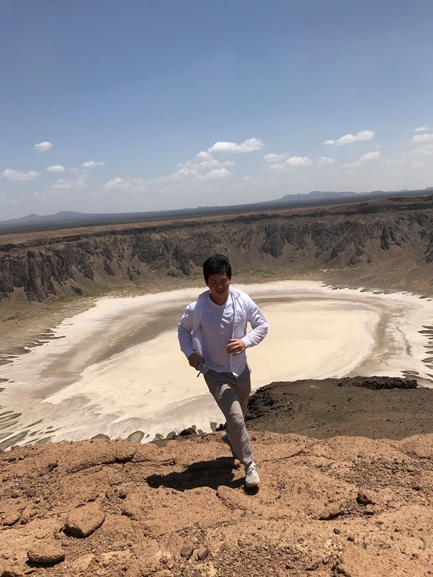

	
	
# Wenbin Zhang 张雯斌 #

I am a [Hakka](https://en.wikipedia.org/wiki/Hakka_people) born PhD student at [University of Maryland, Baltimore County](https://www.umbc.edu/). The main focus of my research is on designing machine learning algorithms that have theoretical performance guarantees and social consciousness. Read about my [research](/research).

During my PhD studies, I also spent time at [L3S Research Center](https://www.l3s.de/de), [University of Milano-Bicocca](https://www.unimib.it/), [King Abdullah University of Science and Technology](https://www.kaust.edu.sa/en), and [Télécom Paris](https://dig.telecom-paristech.fr/blog/). I had four Stendhal syndrome years in [Beijing](https://www.google.com/maps/@39.9553424,116.3162938,17z?hl=en&authuser=0) and [Tianjin](https://www.google.com/maps/@39.1099492,117.2091143,18z?hl=en&authuser=0) before started my study abroad in [Newfoundland](https://www.google.com/maps/@47.5730776,-52.7360975,16z?hl=en&authuser=0), where June snowed (not anymore due to global warming). 

Outside of research, I enjoy watching and playing all kinds of sports especially football. I had my life experience at [Kaliningrad Stadium](https://en.wikipedia.org/wiki/Kaliningrad_Stadium) cheering 2018 World Cup Russia. I run my very first Marathon at [Virginia Beach](https://www.shamrockmarathon.com/) credit to [November Project](https://november-project.com/baltimore-md/). Finally, I believe Manchester is red.

		
Email: `wenbinzhang[at]umbc.edu`

