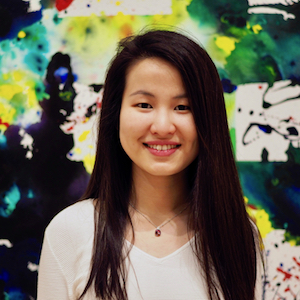

	
	
# Lydia T. Liu #

I am a PhD student in [Computer Science](https://eecs.berkeley.edu/) at University of California, Berkeley, advised by [Moritz Hardt](http://www.moritzhardt.com/) and [Michael I. Jordan](https://people.eecs.berkeley.edu/~jordan/) &alpha;. I am affiliated with [RISELab](http://rise.cs.berkeley.edu/) and [BAIR](http://bair.berkeley.edu/).
I obtained my BSE in [Operations Research and Financial Engineering](https://orfe.princeton.edu/) from Princeton University, where I was fortunate to work with [Amit Singer](https://web.math.princeton.edu/~amits/), [Han Liu](https://www.princeton.edu/~hanliu/), and [Barbara Engelhardt](https://www.cs.princeton.edu/~bee/). Before that, I spent a wonderful summer at Microsoft Research, Cambridge with the [Reinforcement Learning Group](https://www.microsoft.com/en-us/research/group/reinforcement-learning-group/), mentored by Urun Dogan and [Katja Hofmann](https://www.microsoft.com/en-us/research/people/kahofman/).

In 2019-20, I will be supported by a [Microsoft Ada Lovelace Fellowship](https://www.microsoft.com/en-us/research/academic-program/ada-lovelace-fellowship/) and an [Open Philanthropy AI Fellowship](https://www.openphilanthropy.org/focus/global-catastrophic-risks/potential-risks-advanced-artificial-intelligence/open-phil-ai-fellowship-2019-class).

I'm interested in designing **machine learning** algorithms that have **reliable performance guarantees**, and **positive long-term societal impact**. Read about my [research](/projects).

Outside of research, I enjoy photography, music, and <a href="/writing">poetry</a>.
			
Email: `lydiatliu_at_berkeley_dot_edu`

&alpha; alphabetical order 

